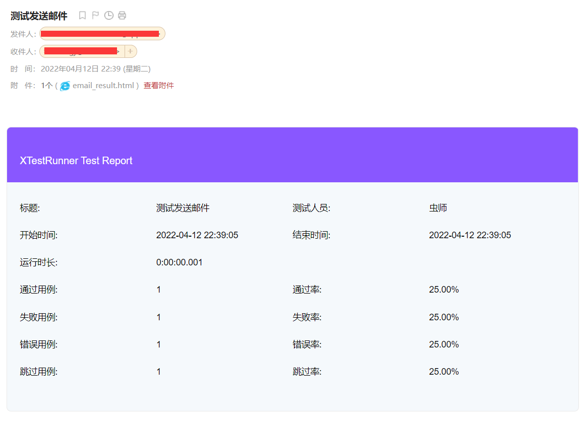

## 发送消息

XTestRunner支持发送不同类型的通知。

### 发送邮件

1. 使用126邮箱发送时password应为授权码而非用户密码，须在邮箱客户端设置开启授权码
2. 使用gmail邮箱发送时password为用户密码，须在gmail客户端开启安全性较低的应用的访问权限

```python
import unittest
from XTestRunner import HTMLTestRunner
from XTestRunner import SMTP
class TestEmail(unittest.TestCase):
    """测试用例说明"""

    def test_success(self):
        self.assertEqual(2 + 3, 5)

    @unittest.skip("skip case")
    def test_skip(self):
        pass

    def test_fail(self):
        self.assertEqual(5, 6)

    def test_error(self):
        self.assertEqual(a, 6)


if __name__ == '__main__':
    suit = unittest.TestSuite()
    suit.addTests([
        TestEmail("test_success"),
        TestEmail("test_skip"),
        TestEmail("test_fail"),
        TestEmail("test_error")
    ])

    report = "./reports/email_result.html"
    with(open(report, 'wb')) as fp:
        runner = HTMLTestRunner(
            stream=fp,
            title='测试发送邮件',
            tester='虫师',
            description=['类型：测试发送邮件'],
            language="zh-CN"
        )
        runner.run(suit)
        # 发送邮件方式 1：send_email()方法
        runner.send_email(
            user="sender@qq.com",
            password="xxx",
            host="smtp.qq.com",
            to="recipient@126.com",
            subject="测试邮件",
            attachments=report
        )
    # 发送方式 2：SMTP类
    smtp = SMTP(user="sender@qq.com", password="xxx", host="smtp.qq.com")
    smtp.sender(to="recipient@126.com", subject="XTestRunner测试邮件", attachments=report)
```

__参数说明__

* user: 邮箱用户名。
* password: 邮箱密码。
* host: 协议，例如："smtp.qq.com" 。
* to: 收件人，例如："recipient@126.com" 或者 ["aa@qq.com", "bb@qq.com"] 。
* subject: 邮件标题。
* attachments: 附件，可以指定生成的测试报告。

__邮件展示__




### 发送钉钉

帮助文档:
https://open.dingtalk.com/document/group/enterprise-created-chatbot

```python
import unittest
from XTestRunner import HTMLTestRunner
from XTestRunner import DingTalk


class TestDing(unittest.TestCase):
    """
    测试用例说明
    """

    def test_success(self):
        self.assertEqual(2 + 3, 5)

    @unittest.skip("skip case")
    def test_skip(self):
        pass

    def test_fail(self):
        self.assertEqual(5, 6)

    def test_error(self):
        self.assertEqual(a, 6)


if __name__ == '__main__':
    suit = unittest.TestSuite()
    suit.addTests([
        TestDing("test_success"),
        TestDing("test_skip"),
        TestDing("test_fail"),
        TestDing("test_error")
    ])

    report = "./reports/dingtalk_result.html"
    with(open(report, 'wb')) as fp:
        runner = HTMLTestRunner(
            stream=fp,
            title='测试发送钉钉',
            tester='虫师',
            description=['类型：测试发送钉钉'],
            language="zh-CN"
        )
        runner.run(suit)
        # 方式一： send_dingtalk() 方法
        runner.send_dingtalk(
            access_token="690900b5ce6d5d10bb1218b8e64a4e2b55f96a6d116aaf50",
            key="xxxx",
            app_secret="xxxxx",
            at_mobiles=[13700000000, 13800000000],
            is_at_all=False,
        )

    # 方式二： DingTalk 类
    ding = DingTalk(
        access_token="690900b5ce6d5d10bb1218b8e64a4e2b55f96a6d116aaf50",
        key="xxxx",
        app_secret="xxxxx",
        at_mobiles=[13700000000, 13800000000],
        is_at_all=False,
    )
    ding.sender()
```

__参数说明__

* access_token:  钉钉机器人的access_token
* key: 如果钉钉机器人安全设置了关键字，则需要传入对应的关键字。
* app_secret: 如果钉钉机器人安全设置了签名，则需要传入对应的密钥。
* at_mobiles: 发送通知钉钉中要@人的手机号列表，如：[137xxx, 188xxx]。
* is_at_all: 是否@所有人，默认为False, 设为True则会@所有人。
